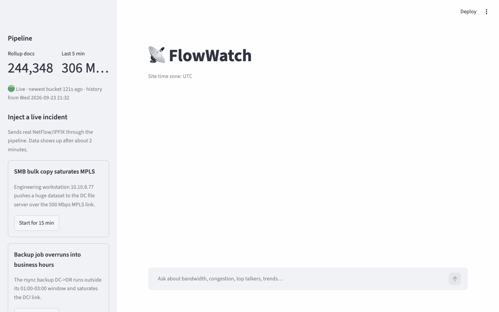

# FlowWatch

This is a demo I created for my [talk](https://penguin02007.github.io/2026-elasticon-network-telemetry-genai) at ElasticON 2026 to show how large language models (LLMs) can work with NetFlow data using Elasticsearch.



## Table of Contents

- [Introduction](#introduction)
- [Quick start](#quick-start)
- [Reproduce the demo](#reproduce-the-demo)
  - [Configuration (`.env`)](#configuration-env)
  - [Operations](#operations)
- [Setup](#setup)
  - [Data Model](#data-model)
  - [LLM](#llm)
  - [Demo script](#demo-script)
- [Reference](#reference)

## Introduction

This demo shows how GenAI can bridge the network domain gap: the knowledge that usually only network engineers have. FlowWatch adds meaningful context to NetFlow data, such as site, application and link names, so anyone can query it and understand the results.

FlowWatch is a Docker Compose stack in which an LLM answers network performance questions as they come up. It works out the answers by
correlating historical flow trends and bandwidth use in Elasticsearch.

## Quick start

The demo has been tested with macOS 26.2 (Apple silicon). System requires at least 4 CPUs and 8 GB RAM for 
Elasticsearch and Kibana.

**1. Install Docker engine with Compose v2.** 

Install one of the following:

- **[Docker Desktop](https://www.docker.com/products/docker-desktop/):** install it, then set
  CPUs and memory under *Settings → Resources*.
- **[Colima](https://github.com/abiosoft/colima)** (recommended, CLI only):

  ```sh
  brew install colima docker docker-compose
  mkdir -p ~/.docker && cat > ~/.docker/config.json <<'JSON'
  { "cliPluginsExtraDirs": ["/opt/homebrew/lib/docker/cli-plugins"] }
  JSON
  colima start --cpu 4 --memory 8 --disk 60
  ```

> [!WARNING]
> This overwrites any existing `~/.docker/config.json`. If you already have one, add the
> `cliPluginsExtraDirs` line to it instead.
>
> On Intel Macs, use `/usr/local/lib/docker/cli-plugins`.
> After a reboot, run `colima start` again.

 > [!NOTE]
 > Check that `docker compose version` prints v2 or later.

**2. Set `GEMINI_API_KEY`.**

```sh
cp .env.example .env              # then set GEMINI_API_KEY in .env
```

**3. Start the stack.** Both options run the same services on the Docker engine from step 1. Pick one:

- **Docker Compose (run the demo):**

  ```sh
  docker compose up -d --build
  docker compose logs -f es-setup   # backfill takes ~30s, then the collector starts (Ctrl-C to exit)
  ./check-stack-health.sh           # Elasticsearch, Kibana, flow freshness, containers
  ```

- **VS Code dev container (change the code):** VS Code attaches to the `flowwatch-app`
  service. Your working copy is mounted at `/workspace`, and Streamlit reloads when you save a
  file.

  1. Install the **Dev Containers** extension (`ms-vscode-remote.remote-containers`). VS Code
     suggests it when you open the repo.
  2. Check that the compose files merge cleanly:

     ```sh
     docker compose -f docker-compose.yaml -f .devcontainer/docker-compose.devcontainer.yml config
     ```

  3. Run **Dev Containers: Reopen in Container** from the Command Palette. The first start
     builds the images and waits for Elasticsearch and `es-setup`, so it takes a few minutes.
     Closing the VS Code window stops the stack.

  Inside the container, run the pipeline tests from the Testing panel or with
  `cd pipeline && python -m unittest discover -s tests`.

Open http://localhost:8501 and click a sample question.


## Reproduce the demo

These steps reproduce [`docs/demo.gif`](docs/demo.gif) manually.

**1. Bring up the stack.** Install Colima as
in [Quick start](#quick-start) step 1, and set `SITE_TZ` to local time zone.

The planted GPU incident runs for 80 minutes and ends 30 minutes before `es-setup` first runs, so
you can ask about it as soon as the stack is up. The question asks about **earlier today**, so
start the stack after about 02:00 site time, when the incident fits inside today. On a later day,
reset with `docker compose down -v` so "earlier today" means today again.

```sh
cp .env.example .env               # then set GEMINI_API_KEY in .env
echo 'SITE_TZ=America/New_York' >> .env   # your time zone
docker compose up -d --build
./check-stack-health.sh            # all OK; es-setup and kibana-setup show "Exited (0)"
open http://localhost:8501
```

`es-setup` backfills 14 days of history in about 30 seconds, then the collector and generator
start. If the health check reports FLOW TSDS as STALE, wait a minute and run it again. The
sidebar should show **🟢 Live** and about 280,000 rollup docs. If you see "GEMINI_API_KEY is not set", add the key to `.env` and run
`docker compose up -d flowwatch-app`.

**2. Start the live incident now,** because it needs about 2 minutes to show up. In the sidebar,
find **Suspicious upload to unknown host** and click **Start for 15 min**. You can also run
`curl -X POST "http://localhost:8000/scenarios/data-exfiltration?minutes=15"`.

**3. Ask why the GPU cluster is slow.** In the sidebar under **Try asking**, click:

> Why was the GPU cluster slow earlier today?

The status shows "Thinking…" and then each Elasticsearch function call. The answer takes 30–90
seconds. Check that it contains:

- A chart of the MPLS link (`edge-rtr-01` `Gi0/0/1`, 500 Mbps), with outbound traffic pinned near
  capacity from about 1 h 50 min to 30 min before you started the stack (site time zone).
- **Evidence:** the GPU cluster (`10.10.9.11–14`) writes checkpoints to NFS on `10.30.3.10` over
  that link. Its throughput fell from about 140 Mbps to about 100–110 Mbps while the link peaked at
  about 485 Mbps (97%). The cause is `file-share-smb`: `10.10.8.77` sent about 200 GB to
  `10.30.2.10:445`, the DC file server.
- **Recommended next steps,** such as QoS that protects the GPU checkpoint traffic and
  investigating `10.10.8.77`.
- **📈 Graphs in Kibana:** links for each host in the answer, plus *all traffic*.

**4. Open the Kibana link.** Click **10.10.8.77** under *Graphs in Kibana*. The **FlowWatch
traffic explorer** dashboard opens filtered to that host and the incident window. It shows
throughput by application, conversation and egress interface, with `file-share-smb` at about
370–430 Mbit/s. Under **Top conversations**, `10.10.8.77 → 10.30.2.10` port 445 has about 200 GB.

**5. Ask about the live incident.** Wait until about 2 minutes have passed since step 2. Then
click **🧹 New conversation**, and under **Try asking** click:

> What is using the internet link right now, and is that normal for this time of day?

Check that the answer contains:

- A chart of total internet bandwidth that climbs sharply in the last few minutes.
- **Evidence:** inbound traffic is normal, but outbound has jumped to about 300+ Mbps. Nearly all
  of it is one HTTPS flow, `10.10.3.45 → 185.220.101.7:443`, and that host normally sends
  almost nothing.
- **Recommended next steps,** such as isolating `10.10.3.45` and blocking `185.220.101.7`.
- **📈 Graphs in Kibana** links for `10.10.3.45` and `185.220.101.7`. Click one to see the
  upload in Kibana.

**6. Clean up.** Stop the incident with **Stop** in the sidebar, or run
`curl -X DELETE http://localhost:8000/scenarios`. Stop the stack with `docker compose down`, or
`docker compose down -v` to also delete the Elasticsearch data.

### Configuration (`.env`)

| Variable | Default | |
|---|---|---|
| `GEMINI_API_KEY` | (none) | required for the chat |
| `GEMINI_MODEL` | `gemini-3.8-flash` | any function-calling Gemini model |
| `SITE_TZ` | `UTC` | business-hours and answer time zone, e.g. `America/Los_Angeles`. Set it before the first `up`, because it shapes the backfill. |
| `BACKFILL_DAYS` | `14` | |

**Gemini free tier:** one answer takes about 4–8 model requests, and free-tier keys allow only
a few requests per minute and about 20 per day **per Google Cloud project**. A new key from the
same project shares that quota. For a live demo, use a key with billing enabled.

### Operations

```sh
./check-stack-health.sh
docker compose logs -f flow-collector          # one line per flushed minute
docker compose run --rm flow-collector python -m unittest discover -s tests   # codec/model tests
docker compose down -v                          # wipe everything, including history
```

**Optional ElastiFlow:** To also feed ElastiFlow (for its Kibana dashboards in `kibana/`), run:

```sh
FLOW_TARGETS=flow-collector:2055,elastiflow:2055 docker compose --profile elastiflow up -d
```

## Setup

Routers export NetFlow v9 and IPFIX to a collector, which stores one-minute rollups in an
Elasticsearch time series data stream (TSDS). An LLM then answers questions by executing function calls, and each
call queries that data through the Elasticsearch Aggregations API.

```text
┌──────────────────────┐   NetFlow v9 / IPFIX   ┌──────────────────────┐
│    flow-generator    │ ───── UDP 2055 ──────> │    flow-collector    │
│  edge-rtr-01    v9   │                        │   template decode    │
│  dc-core-01  IPFIX   │                        │  enrich site/app/if  │
│  incident API :8000  │                        └──────────┬───────────┘
└──────────^───────────┘                                   │ _bulk, 1-min rollups
           │ start / stop incidents                        V
┌──────────┴───────────┐   aggregations         ┌──────────────────────────────────┐
│    flowwatch-app     │ ─────────────────────> │          Elasticsearch           │
│   Streamlit :8501    │ <────── buckets ────── │   TSDS metrics-netflow.flows-*   │
│ agent, 8 functions   │                        │     index.mode: time_series      │
│                      │                        │       flowwatch-inventory        │
└──────┬───────────┬───┘                        └──────────────────────────────────┘
 prompt│   ^ fn    │                                             ^ Lens queries
       │   │ calls └── deep links (KQL + time) ──────┐           │
       V   │                                         V           │
┌──────────┴───────────┐                        ┌────────────────┴─────────────────┐
│   Gemini 3.8 Flash   │                        │           Kibana :5601           │
│   function calling   │                        │    FlowWatch traffic explorer    │
└──────────────────────┘                        └──────────────────────────────────┘
```

| Service | What it does |
|---|---|
| `flow-generator` | Simulates `edge-rtr-01` (**NetFlow v9**) and `dc-core-01` (**IPFIX**) exporting real UDP packets every 5s. Traffic follows business hours, weekends, a nightly backup and link capacity limits. HTTP API on `:8000` injects incidents. |
| `flow-collector` | Template-aware v9/IPFIX decoder. Adds site, application and interface names to each flow, rolls flows up per minute per dimension set, and writes to the TSDS. |
| `es-setup` | Creates TSDS index template, the `flowwatch-inventory` index (interfaces, capacities, applications), and **14 days of backfilled history**. Re-runs are idempotent. |
| `flowwatch-app` | Streamlit chat on [localhost:8501](http://localhost:8501). Gemini picks function calls, and each call runs Elasticsearch aggregations. Every request body is shown in the UI. |
| `kibana` | [localhost:5601](http://localhost:5601), for exploring `metrics-netflow.flows-*` directly. |
| `kibana-setup` | Creates the `FlowWatch flows (TSDS)` data view and the **FlowWatch traffic explorer** dashboard (throughput by application, conversation and egress interface, plus a top-conversations table). |

**Kibana Dashboard:** Under each answer, the app links every host IP it mentions to
the traffic explorer dashboard. The link carries a KQL query (`source.ip:"10.10.8.77" or
destination.ip:"10.10.8.77"`) and the time window of the function call that found the host. Each
function call in the evidence panel also has an *open this slice in Kibana* link that applies the
same filters.


### Data Model

`metrics-netflow.flows-default` is a time series data stream. Each document is one bucket
(1 minute live, 5 minutes for older backfill) for one set of dimensions.

- **Dimensions:** `exporter.name`, `interface.in.name`, `interface.out.name`, `source.ip`, `source.site`, `destination.ip`, `destination.site`, `service.port`, `network.transport`, `application`
- **Metrics (gauge):** `network.bytes`, `network.packets`, `flow.count`

A TSDS write index only accepts data within `index.look_back_time` (7 days at most). To load
14 days of history, the first backing index is therefore created with an explicit
`index.time_series.start_time`/`end_time`. After loading, the stream is rolled over so live
data goes to a normal write index. This is the same technique as Elastic's "reindex a TSDS"
guide; see `pipeline/flowwatch/setup_es.py`.

### LLM

The LLM uses *function calls*: functions the model can ask the app to run. FlowWatch describes each function to
Gemini by name, purpose and a JSON schema of its parameters (time window, group-by dimension,
filters). When a question comes in, Gemini doesn't read raw data, and apart from the
`run_aggregation` escape hatch it doesn't write queries itself. Instead it replies with
*function calls*, for example `top_talkers(start="2026-09-29T13:00",
dimension="conversation", filters={interface_out: "Gi0/0/1"})`.

The app turns each call
into an Elasticsearch aggregation request, runs it against the TSDS, and sends back a compact
JSON summary (Mbps, % of link capacity, peak times, baselines). Gemini can chain several calls - 
for example, first finding the congested link, then who used it, then comparing with normal
days, and it writes the answer only from those results. This keeps answers grounded in real
telemetry, keeps the questions to Elasticsearch efficient, and makes every step auditable: the
UI shows each function call, the exact request body and the result the model saw.

| Function | Aggregations used |
|---|---|
| `get_network_inventory` | Reads the inventory index, and uses `min` and `max` on `@timestamp` to report the available data range |
| `bandwidth_timeseries` | Groups by `terms`, splits each group into time buckets with `date_histogram`, and adds up bytes with `sum` |
| `top_talkers` | Ranks groups with `terms` (or `multi_terms` for conversations) by summed bytes, and finds each group's peak with `date_histogram` and `max_bucket` |
| `interface_utilization` | Splits traffic per interface and direction with `terms`, buckets it over time with `date_histogram`, takes the peak with `max_bucket` and the 95th percentile with `percentiles_bucket`, then compares both with link capacity |
| `compare_to_baseline` | Uses `filters` to pull the current window and the same time on previous comparable days in one request, groups each with `terms`, and compares the current value with the median of the earlier days |
| `traffic_trend` | Buckets traffic by calendar day in the site time zone with `date_histogram`, finds each day's busiest hour with a nested hourly `date_histogram` and `max_bucket`, then calculates the week-over-week change and a growth rate |
| `detect_anomalies` | Groups with `terms` and buckets with `date_histogram` across the window and the baseline days, then compares each bucket with the same time of day on earlier days |
| `run_aggregation` | escape hatch: the LLM writes its own aggregation DSL (no scripts) |

### Demo script

The backfilled history contains these planted events, relative to the day `es-setup` first ran, in
the site time zone (`SITE_TZ`):

| When | What happened | Question to ask |
|---|---|---|
| Today, 1 h 50 min to 30 min before `es-setup` first ran | `10.10.8.77` SMB bulk copy saturates the 500 Mbps MPLS link (97%) and starves the GPU cluster's checkpoint writes (`10.10.9.11–14` → `10.30.3.10` NFS) | "Why was the GPU cluster slow earlier today?" |
| 3 days ago 03:00–09:30 | rsync backup overran its 01:00–03:00 window on the DCI link | "Did the nightly backup behave differently in the last week?" |
| 5 days ago 16:00–17:10 | Windows update storm, about 780 Mbps on the internet uplink | "Find the biggest anomalies in the last 7 days." |
| 8 days ago 10:40 | `10.10.3.45` uploads to `185.220.101.7` | "Has 10.10.3.45 ever sent unusual amounts of data to the internet?" |
| Whole 14 days | Video conferencing grows about 4% a day | "Is video traffic growing? When would the uplink hit 80% at peak?" |

**Live incidents:** in the sidebar, click *Start* on a scenario. Wait about 2 minutes for
the collector to flush, then ask "What is using the internet link right now, and is it normal?"
You can also trigger incidents from a shell:

```sh
curl -X POST "http://localhost:8000/scenarios/data-exfiltration?minutes=15"
curl -X DELETE http://localhost:8000/scenarios
```

Scenarios: `smb-bulk-copy`, `backup-overrun`, `update-storm`, `data-exfiltration`.


## Reference

1. What is [function calling](https://medium.com/@jamestang/llm-function-calling-explained-a-deep-dive-into-the-request-and-response-payloads-894800fcad75)?